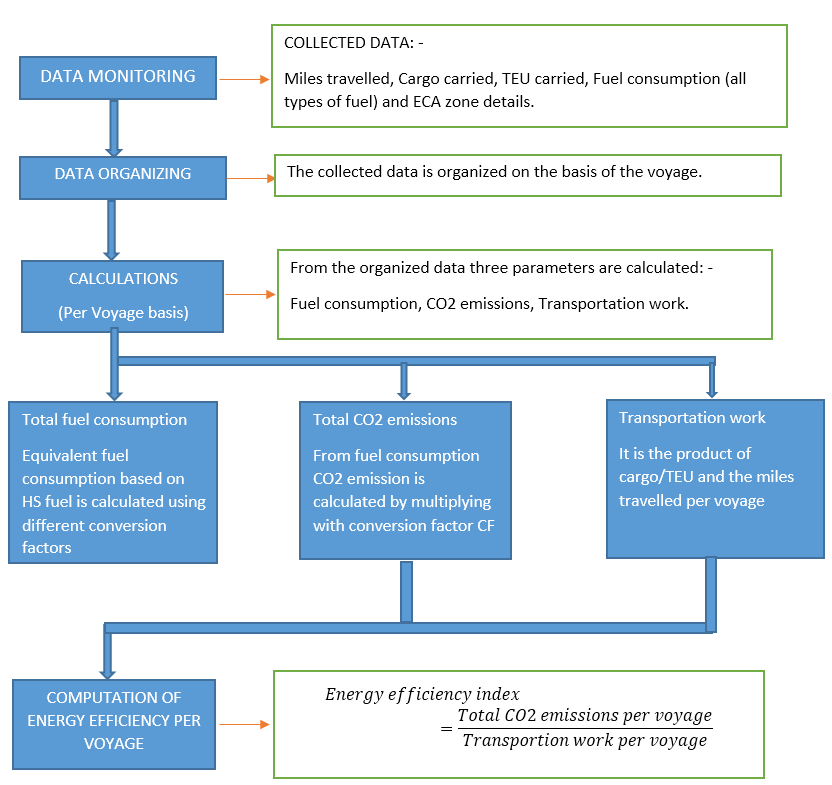
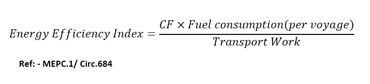

# FLOW CHART FOR ENERGY EFFICIENCY CALCULATIONS

# GENERAL INFO

__*ECA Zones and non-ECA Zones*__ 

***The fuel consumption data for each vessel is collected for both ECA zones and non-ECA zones. ECA zone or Emission Control Zones are sea areas in which stricter controls*** ***were established to minimize airborne emissions (SOx, NOx, Ozone depleting substances, Volatile organic compounds) from ships.***

**Fuel consumption equivalent**

Fuel HS equivalent is the equivalent fuel (tonnes) in terms of HS fuel after converting the other types of fuel used (LS, MDO, MGO, MGO LS) by using conversion factors.

**Fuel mass to CO2 mass conversion factor (CF, in Tonne-CO2/Tonne-Fuel)**

CF is a non-dimensional conversion factor between fuel consumption measured in tonnes and CO2 emission also measured in tonnes based on carbon content.
CO2 in tonnes can be calculated by multiplying CF with the respective fuel consumption.

**Transportation** **work**

Transportation work based on Tonne- miles is the product of cargo per voyage in tonnes and the distance travelled in miles per voyage.
Transportation work based on TEU- miles is the product of cargo per voyage in tonnes and the distance travelled in miles per voyage.
The total transportation work is the sum of transportation work of all the voyages.
 
**EEOI/MRV Calculations** 

For each voyage the energy efficiency is calculated. For the calculation of energy efficiency, the following formula is used.

Here CF is the factor used for the conversion of the fuel mass to equivalent carbon content. This varies from fuel types.
This index may be in terms of gram CO2/Tonne-mile or gram CO2/TEU-mile, based on the data used for calculations.

---

Generally used values are:

|Type OF Fuel                          | Carbon Content |  CF (t-CO2/t-Fuel) | References                    |
|--------------------------------------|:--------------:|:------------------:|-------------------------------|
|1. Diesel/gas oil                     | 0.875          |3.206               |ISO 8217 Grades DMX through DMC|
|2. Light fuel oil(LFO)                | 0.860          |3.151               |ISO 8217 Grades RMA through RMD|
|3. Heavy fuel oil(HFO)                | 0.850          |3.114               |ISO 8217 Grades RME through RMK|
|4. Liquified Petroleum Gas(LPG)Propane| 0.819          |3.000               |-                              |
|5. Liquified Petroleum Gas(LPG)Butane | 0.827          |3.030               |-                              |
|6. Liquified Natural Gas(LNG)         | 0.750          |2.750               |-                              |

---

Ref:- MEPC.1/Circ.684

*The methodology used in the calculation of energy efficiency in MRV is similar to that of EEOI but the only difference is that in MRV the data relating to the "IN PORT" condition is not taken*

**Moving average in EEOI**

For EEOI, average energy efficiency is calculated. The average will be based on the selected moving average period.

