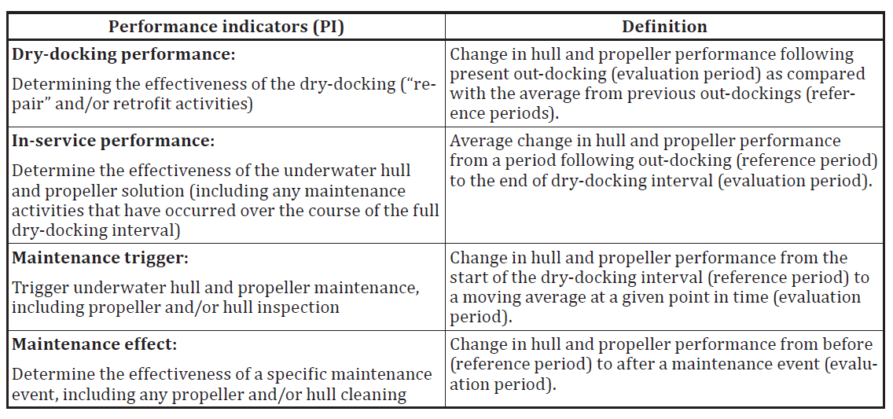
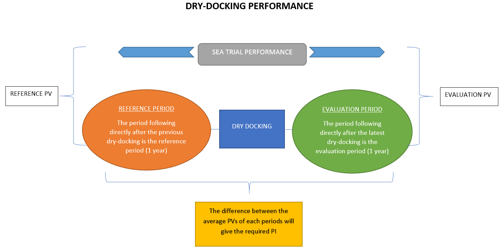
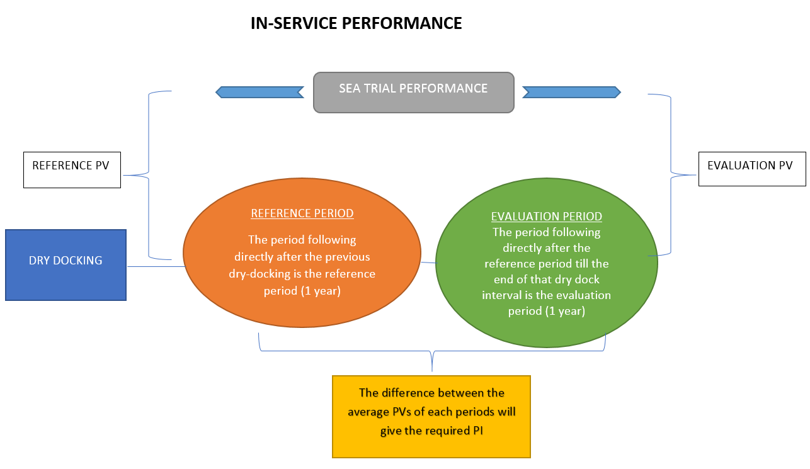
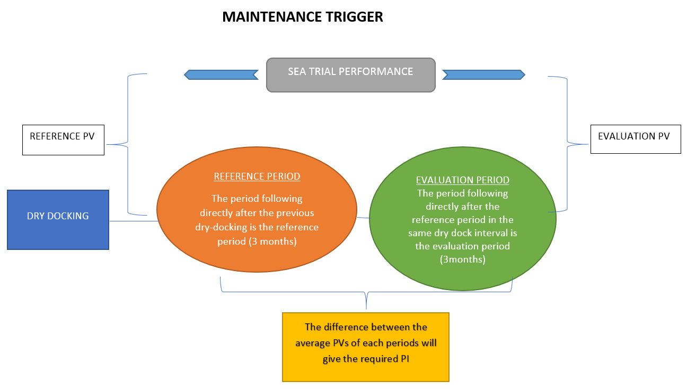
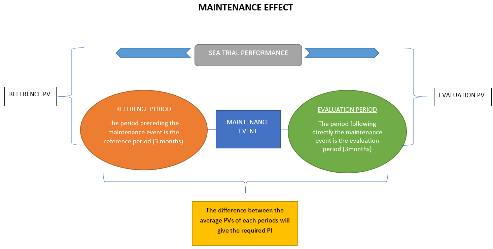

#                                                          ISO 19030 Method

### INTRODUCTION  

   Hull and propeller performance refers to the relationship between the condition of a ship's underwater hull and propeller and the power required to move the ship through water at a given speed. Measurements of changes in ship specific hull and propeller performance over time make it possible to indicate the impact of hull and propeller maintenance, repair and retrofit activities on the overall energy efficiency of the ship in question.

   The aim of this method is to measure changes in ship specific hull and propeller performance and to define a set of relevant **performance indicators(PIs)** for hull and propeller maintenance, repair and retrofit activities. The methods are not intended for comparing the performance of ships of different types and sizes (including sister ships) but to compare it with itself over a period of time.
   
### Performance indicators(PI): 

   ISO 19030 defines four PIs.  

### Performance value(PV) :

  The performance value defined in ISO 19030 is the *Percentage speed loss*. The percentage speed loss is the loss of speed a ship encounters during its service when compared to the Speed trial data. This PV is then used to calculate different performance indicators.

### Reference period and evaluation period :
  
  These are the two periods which are taken for calculating the performance indicators. The users can select these periods according to their requirements.  These periods vary for each PI and varies from 1 year to 3 months (both reference and evaluation period) depending upon the Performance we are evaluating. The difference between the average PVs of reference and evaluation period gives the indication about the performance of the vessel. For example if this difference is positive then it means that the performance is improved after the event. 

  For each PIs ISO recommended reference period and evaluation periods are as follows.

-----

-----

-----

-----

